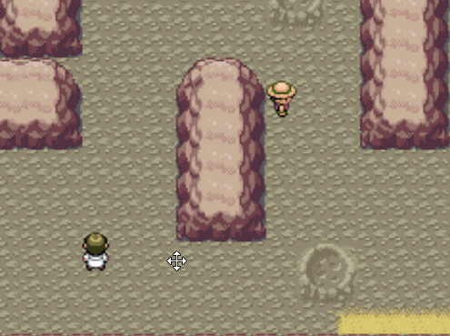
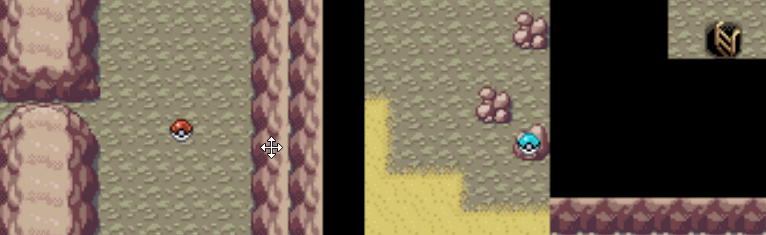
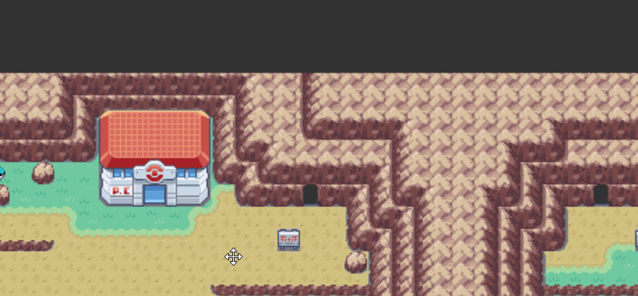
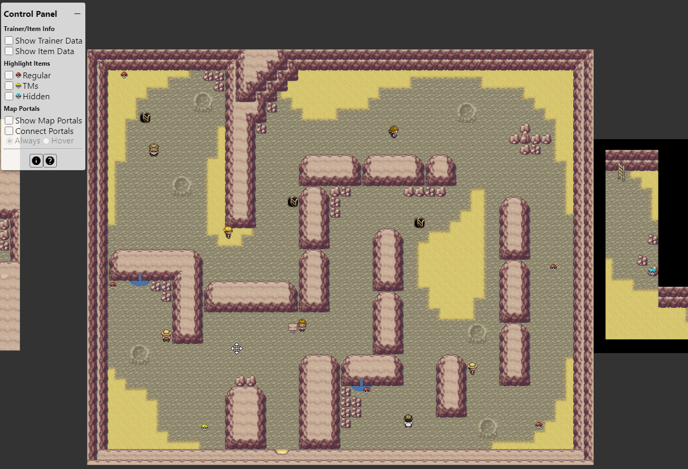

# Pokemon FireRed/LeafGreen Ironmon Map

## https://kelseyyoung.github.io/FRLGIronmonMap

This is an interactive map of Pokemon FireRed/LeafGreen meant for Ironmon challenge runners. For information on what Ironmon is, [join the discord](https://discord.gg/QEEsmNUX)

## Looking for other Ironmon Maps?

[Emerald](https://kelseyyoung.github.io/EmeraldIronmonMap)

## Using the map

Trainer information is available on hover, showing the number of pokemon they have, the levels of their pokemon, and any movement information. Trainers can be "marked" by clicking on them

Items are also clickable/markable, and hidden items with step spawn rates have that information shown on hover

Map "portals", like cave entrances and ladders, are clickable too! They will move the map to where it connects

You can highlight all map portals via the Control Panel with various display options

## Developers

1. Clone the repo
2. Update the IronmonMapUtils submodule

- First time initialization: `git submodule update --init --recursive`
- Futher updates: `git pull --recurse-submodules`
- See the README in the [IronmonMapUtils repo](https://github.com/kelseyyoung/IronmonMapUtils) for more info

3. Run `yarn` to install dependencies
4. Run `yarn start` to start a local dev server

## Found an issue? Want to suggest a feature?

This is very much still a work in progress so there are sure to be bugs/missing data. The best way to file an issue is on [Github](https://github.com/kelseyyoung/FRLGIronmonMap/issues) or contact me on Discord (kelsey#8920)
